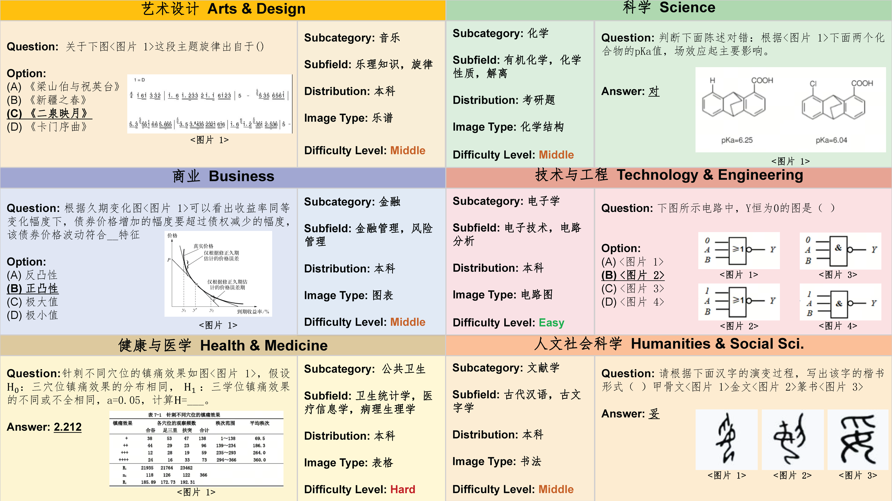

# CMMMU

[**🌐 Homepage**](https://cmmmu-benchmark.github.io/) | [**🤗 Paper**](https://huggingface.co/papers/2401.11944) | [**📖 arXiv**](https://arxiv.org/abs/2401.11944) | [**🤗 Dataset**](https://huggingface.co/datasets/m-a-p/CMMMU) | [**GitHub**](https://github.com/CMMMU-Benchmark/CMMMU)

This repo contains the evaluation code for the paper "[CMMMU: A Chinese Massive Multi-discipline Multimodal Understanding Benchmark](https://arxiv.org/abs/2401.11944)"

## Introduction
CMMMU includes 12k manually collected multimodal questions from college exams, quizzes, and textbooks, covering six core disciplines: Art & Design, Business, Science, Health & Medicine, Humanities & Social Science, and Tech \& Engineering, like its companion, MMMU. These questions span 30 subjects and comprise 39 highly heterogeneous image types, such as charts, diagrams, maps, tables, music sheets, and chemical structures.



## Evaluation
Please refer to our [eval](eval)
 folder for more details.

## 🏆 Mini-Leaderboard
| Model                          | Val (900) | Test (11K) |
|--------------------------------|:---------:|:------------:|
| GPT-4V(ision) (Playground)     | **42.5**  |   **43.7**   |
| Qwen-VL-PLUS*                  |   39.5    |     36.8     |
| Yi-VL-34B                      |   36.2    |     36.5     |
| Yi-VL-6B                       |   35.8    |     35.0     |
| InternVL-Chat-V1.1*            |   34.7    |     34.0     |
| Qwen-VL-7B-Chat                |   30.7    |     31.3     |
| SPHINX-MoE*                    |   29.3    |     29.5     |
| InternVL-Chat-ViT-6B-Vicuna-7B |   26.4    |     26.7     |
| InternVL-Chat-ViT-6B-Vicuna-13B|   27.4    |     26.1     |
| CogAgent-Chat                  |   24.6    |     23.6     |
| Emu2-Chat                      |   23.8    |     24.5     |
| Chinese-LLaVA                  |   25.5    |     23.4     |
| VisCPM                         |   25.2    |     22.7     |
| mPLUG-OWL2                     |   20.8    |     22.2     |
| Frequent Choice                |   24.1    |     26.0     |
| Random Choice                  |   21.6    |     21.6     |

*: results provided by the authors.

## Disclaimers
The guidelines for the annotators emphasized strict compliance with copyright and licensing rules from the initial data source, specifically avoiding materials from websites that forbid copying and redistribution. 
Should you encounter any data samples potentially breaching the copyright or licensing regulations of any site, we encourage you to [contact](#contact) us. Upon verification, such samples will be promptly removed.

## Contact
- Ge Zhang: zhangge@01.ai
- Wenhao Huang: huangwenhao@01.ai
- Xinrun Du: duxinrun@intern.01.ai
- Bei Chen: chenbei@01.ai
- Wenhu Chen: wenhuchen@uwaterloo.ca
- Jie Fu: jiefu@ust.hk

## Citation

**BibTeX:**
```bibtex
@article{zhang2024cmmmu,
        title={CMMMU: A Chinese Massive Multi-discipline Multimodal Understanding Benchmark},
        author={Ge, Zhang and Xinrun, Du and Bei, Chen and Yiming, Liang and Tongxu, Luo and Tianyu, Zheng and Kang, Zhu and Yuyang, Cheng and Chunpu, Xu and Shuyue, Guo and Haoran, Zhang and Xingwei, Qu and Junjie, Wang and Ruibin, Yuan and Yizhi, Li and Zekun, Wang and Yudong, Liu and Yu-Hsuan, Tsai and Fengji, Zhang and Chenghua, Lin and Wenhao, Huang and Wenhu, Chen and Jie, Fu},
        journal={arXiv preprint arXiv:2401.20847},
        year={2024},
      }
```
